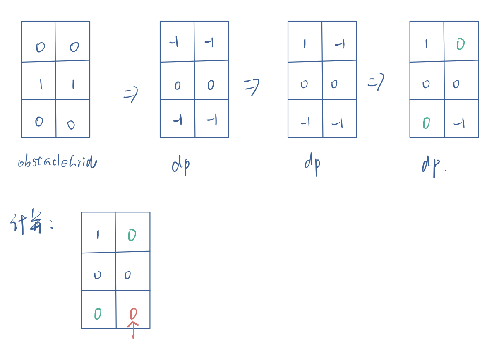

### 0063. 不同路径 II

#### 题目地址：https://leetcode-cn.com/problems/unique-paths-ii/

一个机器人位于一个 m x n 网格的左上角 （起始点在下图中标记为“Start” ）。

机器人每次只能向下或者向右移动一步。机器人试图达到网格的右下角（在下图中标记为“Finish”）。

现在考虑网格中有障碍物。那么从左上角到右下角将会有多少条不同的路径？


网格中的障碍物和空位置分别用 `1` 和 `0` 来表示。

**示例 1：**


```
输入：obstacleGrid = [[0,0,0],[0,1,0],[0,0,0]]
输出：2
解释：
3x3 网格的正中间有一个障碍物。
从左上角到右下角一共有 2 条不同的路径：
1. 向右 -> 向右 -> 向下 -> 向下
2. 向下 -> 向下 -> 向右 -> 向右
```

**示例 2：**


```
输入：obstacleGrid = [[0,1],[0,0]]
输出：1
```

**提示：**

- `m == obstacleGrid.length`
- `n == obstacleGrid[i].length`
- `1 <= m, n <= 100`
- `obstacleGrid[i][j] 为 0 或 1`

---

**Java**

``` java
class Solution {
    public int uniquePathsWithObstacles(int[][] obstacleGrid) {
        if(obstacleGrid[0][0] == 1) return 0;
        int m = obstacleGrid.length;
        int n = obstacleGrid[0].length;
        int[][] dp = new int[m][n];
        for(int i = 0; i < m; i++){
            for(int j = 0; j < n; j++){
                if(obstacleGrid[i][j] == 1){
                    if(m == 1 || n == 1) return 0;
                    // 有石头代表0
                    dp[i][j] = 0;
                } 
                else dp[i][j] = -1;
            }
        }
        dp[0][0] = 1;
        for(int i = 1; i < m; i++){
            if(dp[i - 1][0] == 0) dp[i][0] = 0;
            else if(dp[i][0] == -1) dp[i][0] = 1;
        }
        for(int j = 1; j < n; j++){
            if(dp[0][j - 1] == 0) dp[0][j] = 0;
            else if(dp[0][j] == -1) dp[0][j] = 1;
        }
        for(int i = 1; i < m; i++){
            for(int j = 1; j < n; j++){
                if(dp[i][j] == 0) continue;
                dp[i][j] = dp[i - 1][j] + dp[i][j - 1];
            }
        }
        return dp[m - 1][n - 1];
    }
}
```

和62题思路一样，让第一行第一列都为1，有石头的位置为0（代表无法到达），但是需要考虑石头会产生什么影响：

- 石头在第一行或者第一列，后面不能为1，只能为1
- 初始化dp数组时，除了石头位置，第一行第一列位置，其他初始化为-1，以免后面`if(dp[i][j] == 0) continue;`误判

