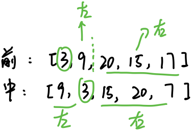
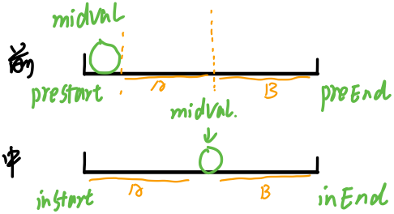
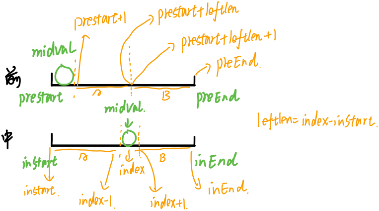

### 题目地址：https://leetcode-cn.com/problems/construct-binary-tree-from-preorder-and-inorder-traversal/

根据一棵树的前序遍历与中序遍历构造二叉树。

**注意:**
你可以假设树中没有重复的元素。

例如，给出

前序遍历 preorder = [3,9,20,15,7]
中序遍历 inorder = [9,3,15,20,7]
返回如下的二叉树：

        3
       / \
      9  20
        /  \
       15   7
---

本文参考：labuladong公众号文章

！做本题建议复习知识：二叉树的前、中、后序遍历和给出前中、中后序遍历序列手动还原一颗二叉树，同时还应具备一定的回溯算法书写能力

**思路：**

1. 根据前序遍历，可以知道第一个结点就是我们的根节点（根左右）

2. 去中序遍历中寻找我们的根节点root，此时root把中序遍历拆分为左右2个部分，左边是root左子树的中序序列（称为A），右边是root右子树的中序序列（称为B）
3. 此时再去看前序序列，除了根节点，剩下的后面由A+B组成，不断重复上述过程，便可以重建一颗二叉树
4. 

可以看出其实也是一个回溯的过程，但是因为每次操作的序列不同的（逐步在缩小范围），因此我们需要变量来控制边界，因此我们另起一个函数build（int[] preorder, int preStart, int preEnd, int[] inorder, int inStart, int inEnd）

 ``` java
class Solution {
    public TreeNode buildTree(int[] preorder, int[] inorder) {
        return build(preorder, 0, preorder.length - 1, inorder, 0, inorder.length - 1);
    }

    public TreeNode build(int[] preorder, int preStart, int preEnd,
                          int[] inorder, int inStart, int inEnd){
        if(preStart > preEnd) return null;

        int midval = preorder[preStart];
        int index = -1;
        for(int i = inStart; i <= inEnd; i++){
            if(inorder[i] == midval){
                index = i;
                break;
            }
        }

        TreeNode root = new TreeNode(midval);
        int leftlen = index - inStart;
        // 注意看 ? 处
        root.left = build(preorder, ?, ?, inorder, ?, ?);
        root.right = build(preorder, ?, ?, inorder, ?, ?);

        return root;
    }
}
 ```

现在的问题是？处应该填什么



A在两个数组的起始范围就是root.left的?处的值，B在两个数组的起始范围就是root.right的?处的值



因此可以写出完整的代码

**Java**

``` java
/**
 * Definition for a binary tree node.
 * public class TreeNode {
 *     int val;
 *     TreeNode left;
 *     TreeNode right;
 *     TreeNode(int x) { val = x; }
 * }
 */
class Solution {
    public TreeNode buildTree(int[] preorder, int[] inorder) {
        return build(preorder, 0, preorder.length - 1, inorder, 0, inorder.length - 1);
    }

    public TreeNode build(int[] preorder, int preStart, int preEnd,
                          int[] inorder, int inStart, int inEnd){
        if(preStart > preEnd) return null;

        int midval = preorder[preStart];
        int index = -1;
        for(int i = inStart; i <= inEnd; i++){
            if(inorder[i] == midval){
                index = i;
                break;
            }
        }

        TreeNode root = new TreeNode(midval);
        int leftlen = index - inStart;
        // Here
        root.left = build(preorder, preStart + 1, preStart + leftlen, inorder, inStart, index - 1);
        root.right = build(preorder, preStart + leftlen + 1, preEnd, inorder, index + 1, inEnd);

        return root;
    }
}
```

