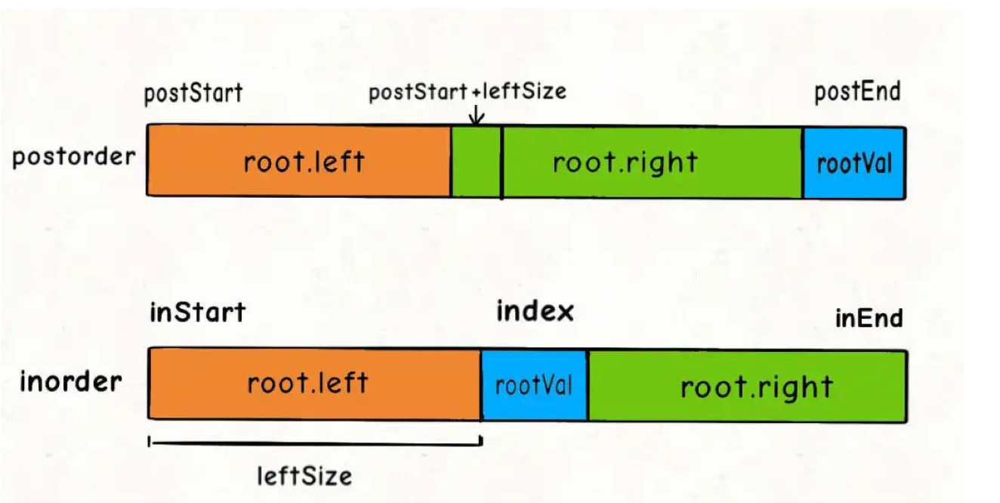

### 题目地址：https://leetcode-cn.com/problems/construct-binary-tree-from-inorder-and-postorder-traversal/

根据一棵树的中序遍历与后序遍历构造二叉树。

**注意:**
你可以假设树中没有重复的元素。

例如，给出

```
中序遍历 inorder = [9,3,15,20,7]
后序遍历 postorder = [9,15,7,20,3]
```

返回如下的二叉树：

        3
       / \
      9  20
        /  \
       15   7
---

在做这个题之前，可以参照前面[0105-从前序与中序遍历序列构造二叉树](../0105-Construct%20Binary%20Tree%20from%20Preorder%20and%20Inorder%20Traversal/0105-Construct%20Binary%20Tree%20from%20Preorder%20and%20Inorder%20Traversal.md)，思路和解题方法都一致，只是在于递归调用自己时参数变化不同，至于怎么从中序和后序序列还原一颗二叉树就不再赘述，直接上一个图，根据这个图填写参数



**Java代码**

```java
/**
 * Definition for a binary tree node.
 * public class TreeNode {
 *     int val;
 *     TreeNode left;
 *     TreeNode right;
 *     TreeNode(int x) { val = x; }
 * }
 */
class Solution {
    public TreeNode buildTree(int[] inorder, int[] postorder) {
        return build(inorder, 0, inorder.length - 1, postorder, 0, postorder.length - 1);
    }

    public TreeNode build(int[] inorder, int inStart, int inEnd,
                          int[] postorder, int postStart, int postEnd){
        if(inStart > inEnd) return null;

        int rootval = postorder[postEnd];
        int index = -1;
        //从中序中找到root
        for(int i = inStart; i <= inEnd; i++){
            if(inorder[i] == rootval){
                index = i;
                break;
            }
        }
        TreeNode root = new TreeNode(rootval);
        int leftlen = index - inStart;
        // !!! 参数在这里 ！！！
        root.left = build(inorder, inStart, index - 1, postorder, postStart, postStart + leftlen - 1);
        root.right = build(inorder, index + 1, inEnd, postorder, postStart + leftlen, postEnd - 1);
        return root;
                              
    }
}
```

