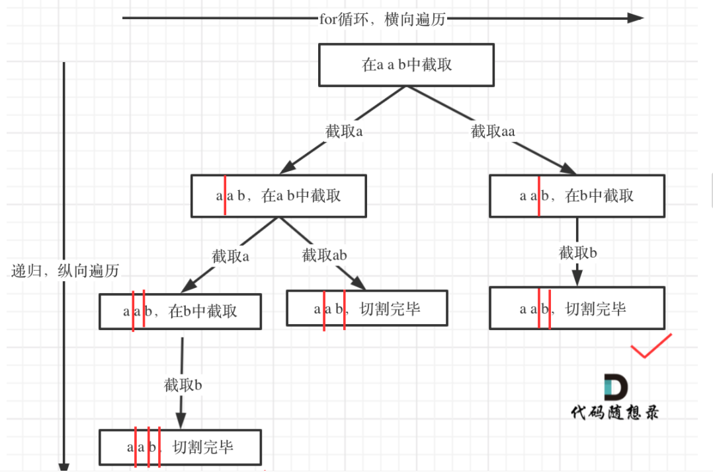

### 题目地址：https://leetcode-cn.com/problems/palindrome-partitioning/

给定一个字符串 s，将 s 分割成一些子串，使每个子串都是回文串。

返回 s 所有可能的分割方案。

**示例:**

``` java
输入: "aab"
输出:
[
  ["aa","b"],
  ["a","a","b"]
]
```

---

参考地址：https://leetcode-cn.com/problems/palindrome-partitioning/solution/131-fen-ge-hui-wen-chuan-hui-su-sou-suo-suan-fa-xi/



需要关注几个问题：

- 用什么模拟切割线？ ---- 可以index来记录

- 什么时候结束递归：在切割线走到最后的时候，也就是`index == len`的时候
- 在每一次的截取的过程中判断该次截取是否是回文串（双指针判断），不是的话直接continue


**Java**

``` java
class Solution {
    // 这是最后的结果集
     List<List<String>> list = new ArrayList<>();
    public List<List<String>> partition(String s) {
        // 记录决策树走过的路径
        List<String> path = new ArrayList<>();
        backtrack(s,0, path);
        return list;
    }

    private void backtrack(String s, int start, List<String> path) {
        if (start == s.length()) {
            // 注意：这里一定是new ArrayList<>(path)，而不是直接list.add(path)
            // 不然结果会为空
            list.add(new ArrayList<>(path));
            return;
        }
        for (int i = start; i < s.length(); i++) {
            // i + 1
            String s1 = s.substring(start, i + 1);
            if (!isPalindrome(s1)) {
                continue;
            }
            // 做选择
            path.add(s1);
            // 进入下一层回溯
            backtrack(s,i + 1, path);
            // 撤销选择
            path.remove(path.size() - 1);
        }
    }
	// 双指针判断是否是回文
    private boolean isPalindrome(String s) {
        if (s == null || s.length() <= 1) {
            return true;
        }
        int left = 0;
        int right = s.length() - 1;
        while (left < right) {
            if (s.charAt(left) != s.charAt(right)) {
                return false;
            }
            left++;
            right--;
        }
        return true;
    }
}
```


**感悟：**

- 回溯写到现在，有时候知道应该用回溯写，但是不知道从何下手，也就是思路不明确
- 本题只是不知道该如何回溯，但是只要知道思路还是能写出代码（说明自己有进步！）


