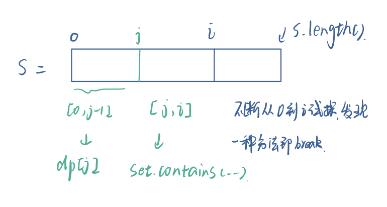

### 0139. 单词拆分

#### 题目地址：https://leetcode-cn.com/problems/word-break/

给定一个非空字符串 s 和一个包含非空单词的列表 wordDict，判定 s 是否可以被空格拆分为一个或多个在字典中出现的单词。

**说明：**

- 拆分时可以重复使用字典中的单词。

- 你可以假设字典中没有重复的单词。

**示例 1：**

```
输入: s = "leetcode", wordDict = ["leet", "code"]
输出: true
解释: 返回 true 因为 "leetcode" 可以被拆分成 "leet code"。
```

**示例 2：**

```
输入: s = "applepenapple", wordDict = ["apple", "pen"]
输出: true
解释: 返回 true 因为 "applepenapple" 可以被拆分成 "apple pen apple"。
     注意你可以重复使用字典中的单词。
```

**示例 3：**

```
输入: s = "catsandog", wordDict = ["cats", "dog", "sand", "and", "cat"]
输出: false
```

---

**Java**

``` java
class Solution {
    public boolean wordBreak(String s, List<String> wordDict) {
        Set<String> set = new HashSet<>();
        boolean[] dp = new boolean[s.length() + 1];
        int maxlen = -1;
        for(String str : wordDict){
            set.add(str);
            if(str.length() >= maxlen) maxlen = str.length();
        }
        dp[0] = true;
        for(int i = 1; i < dp.length; i++){
            for(int j = (i < maxlen ? 0 : i - maxlen); j < i; j++){
                if(dp[j] && set.contains(s.substring(j, i))){
                    dp[i] = true;
                    break;
                }
            }
        }
        return dp[dp.length - 1];
    }
}
```

参考：https://leetcode-cn.com/problems/word-break/solution/shou-hui-tu-jie-san-chong-fang-fa-dfs-bfs-dong-tai/

先说一下`dp[i]`代表的意思：表明字符串`s`的前`i`个字符是否可以正确拆分，因此每一步都是根据前面来的，所以关注点到了判断条件这里：`if(dp[j] && set.contains(s.substring(j, i)))`，也就是说当前这里是填`true`还是`false`，是看能不能划分成2个部分，恰好2个部分都可以正确划分，此时就可以用到前面的数据了

