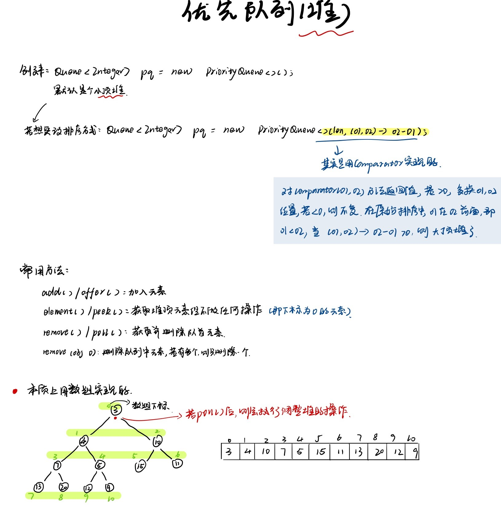

### 题目地址：https://leetcode-cn.com/problems/top-k-frequent-elements/

给定一个非空的整数数组，返回其中出现频率前 k 高的元素。 

**示例 1:**

输入: nums = [1,1,1,2,2,3], k = 2
输出: [1,2]

**示例 2:**

输入: nums = [1], k = 1
输出: [1]

**提示：**

- 你可以假设给定的 k 总是合理的，且 1 ≤ k ≤ 数组中不相同的元素的个数。
- 你的算法的时间复杂度**必须**优于 O(n log n) , n 是数组的大小。
- 题目数据保证答案唯一，换句话说，数组中前 k 个高频元素的集合是唯一的。
- 你可以按任意顺序返回答案。

---

**解释：**

1. 题目换句话说，就是求topK的问题，topK的问题一般使用堆来实现

2. 首先计算每个数字的出现次数，再根据次数求topK

3. 在java里使用优先队列`PriorityQueue`，他底层的实现其实就是堆，在每一次执行取出元素等其他操作时，也就是对应的堆在进行相应的调整（想知道具体怎么调整，建议网上搜索教程学习）

4. **本题使用的是小顶堆，并不是大顶堆，小顶堆堆顶元素也就是最小的元素，当前拿到一个数字和它的出现次数，只需要判断它的出现次数和堆顶元素的出现次数的大小即可（判断是否需要取代），通过这样去不断动态调整这个堆**

5. 在`remove()`元素后堆的调整我们不必手动进行，java底层自动维护

6. 附上一张内容不是很完整的优先队列总结图

   </img>


### Java

``` java
class Solution {
    public int[] topKFrequent(int[] nums, int k) {
        int[] res = new int[k];
        Map<Integer, Integer> map = new HashMap<>();
        // 计算出现次数
        for(int num : nums){
            map.put(num, map.getOrDefault(num, 0) + 1);
        }
        // 优先队列-小顶堆
        PriorityQueue<Integer> heap = new PriorityQueue<>((o1, o2) -> (map.get(o1) - map.get(o2)));
        for(int key : map.keySet()){
            if(heap.size() < k) heap.add(key);
            else if(map.get(key) > map.get(heap.peek())){
                // 删除队首元素 (最小的那个)
                heap.remove();
                heap.add(key);
            }
        }
        int index = 0;
        while(!heap.isEmpty()){
            res[index++] = heap.remove();
        }
        return res;
    }
}
```

