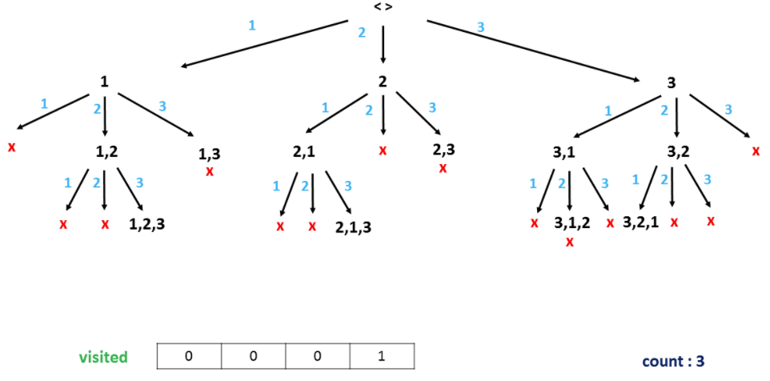

### 题目地址：https://leetcode-cn.com/problems/beautiful-arrangement/

假设有从 1 到 N 的 N 个整数，如果从这 N 个数字中成功构造出一个数组，使得数组的第 i 位 (1 <= i <= N) 满足如下两个条件中的一个，我们就称这个数组为一个优美的排列。条件：

- 第 i 位的数字能被 i 整除
- i 能被第 i 位上的数字整除

现在给定一个整数 N，请问可以构造多少个优美的排列？

**示例1:**

``` java
输入: 2
输出: 2
**解释:** 

第 1 个优美的排列是 [1, 2]:
  第 1 个位置（i=1）上的数字是1，1能被 i（i=1）整除
  第 2 个位置（i=2）上的数字是2，2能被 i（i=2）整除

第 2 个优美的排列是 [2, 1]:
  第 1 个位置（i=1）上的数字是2，2能被 i（i=1）整除
  第 2 个位置（i=2）上的数字是1，i（i=2）能被 1 整除说明:
```

N 是一个正整数，并且不会超过15

**解释**



**Java**

``` java
class Solution {
    int count = 0;
    public int countArrangement(int N) {
        boolean visited[] = new boolean[N + 1];
        caculate(N, 1, visited);
        return count;
    }

    public void caculate(int N, int pos, boolean[] visited){
        if(pos > N){
            count++;
            return;
        }
        for(int i = 1; i <= N; i++){
            if(!visited[i] && (pos % i == 0 || i % pos == 0)){
                // 做选择
                visited[i] = true;
                // 进入下一层
                caculate(N, pos + 1, visited);
                // 撤销选择
                visited[i] = false;
            }
        }
    }
}
```

