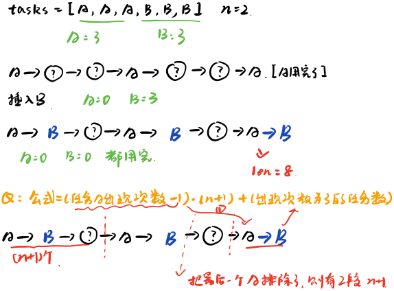
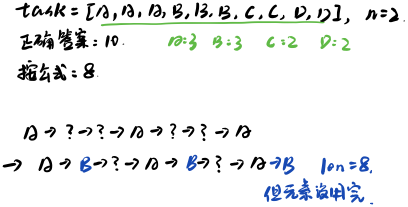

### 题目地址：https://leetcode-cn.com/problems/task-scheduler/

给定一个用字符数组表示的 CPU 需要执行的任务列表。其中包含使用大写的 A - Z 字母表示的26 种不同种类的任务。任务可以以任意顺序执行，并且每个任务都可以在 1 个单位时间内执行完。CPU 在任何
一个单位时间内都可以执行一个任务，或者在待命状态。然而，两个相同种类的任务之间必须有长度为 n 的冷却时间，因此至少有连续 n 个单位时间内 CPU 在执行不同的任务，或者在待命状态。你需要计算
完成所有任务所需要的最短时间。

**示例 ：**

输入：tasks = ["A","A","A","B","B","B"], n = 2 <br>
输出：8 <br>
解释：A -> B -> (待命) -> A -> B -> (待命) -> A -> B. <br>
在本示例中，两个相同类型任务之间必须间隔长度为 n = 2 的冷却时间，而执行一个任务只需要一个单位时间，所以中间出现了（待命）状态。 


**提示：**

1. 任务的总个数为 [1, 10000]。
2. n 的取值范围为 [0, 100]。

---

**解释：**

1. [先看我](https://leetcode-cn.com/problems/task-scheduler/solution/python-xiang-jie-by-jalan/)，我根据这个讲解解释一下
2. 公式的由来：<br>
<div align=center>

</div>
3. 特殊情况：<br>
<div align=center>
   
</div>

### Java
``` java
class Solution {
    public int leastInterval(char[] tasks, int n) {
        if(n == 0) return tasks.length;
        int max = -1;
        Map<Character, Integer> map = new HashMap<>();
        for(char task : tasks){
            map.put(task, map.getOrDefault(task, 0) + 1);
            if(map.get(task) > max) max = map.get(task);
        }
        int maxCount = 0;
        for(char c : map.keySet()){
            if(map.get(c) == max) maxCount++;
        }
        return Math.max(tasks.length, (max - 1) * (n + 1) + maxCount);
    }
}
```

