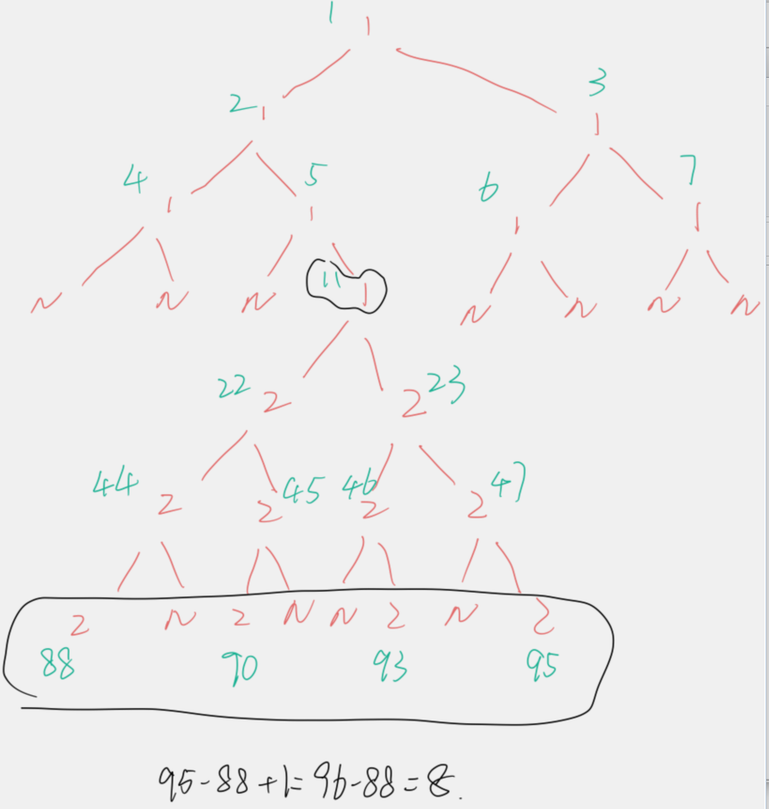

### 0662. 二叉树最大宽度

#### 题目地址：https://leetcode-cn.com/problems/maximum-width-of-binary-tree/

给定一个二叉树，编写一个函数来获取这个树的最大宽度。树的宽度是所有层中的最大宽度。这个二叉树与满二叉树（full binary tree）结构相同，但一些节点为空。

每一层的宽度被定义为两个端点（该层最左和最右的非空节点，两端点间的null节点也计入长度）之间的长度。

**示例 1:**

```
输入: 

           1
         /   \
        3     2
       / \     \  
      5   3     9 

输出: 4
解释: 最大值出现在树的第 3 层，宽度为 4 (5,3,null,9)。
```

**示例 2:**

```
输入: 

          1
         /  
        3    
       / \       
      5   3     

输出: 2
解释: 最大值出现在树的第 3 层，宽度为 2 (5,3)。
```

**示例 3:**

```
输入: 

          1
         / \
        3   2 
       /        
      5      

输出: 2
解释: 最大值出现在树的第 2 层，宽度为 2 (3,2)。
```

**示例 4:**

```
输入: 

          1
         / \
        3   2
       /     \  
      5       9 
     /         \
    6           7
输出: 8
解释: 最大值出现在树的第 4 层，宽度为 8 (6,null,null,null,null,null,null,7)。
```

**注意:** 答案在32位有符号整数的表示范围内。

----

**Java**

```java
/**
 * Definition for a binary tree node.
 * public class TreeNode {
 *     int val;
 *     TreeNode left;
 *     TreeNode right;
 *     TreeNode() {}
 *     TreeNode(int val) { this.val = val; }
 *     TreeNode(int val, TreeNode left, TreeNode right) {
 *         this.val = val;
 *         this.left = left;
 *         this.right = right;
 *     }
 * }
 */
class Solution {
    Queue<TreeNode> queue = new LinkedList<>();
    int max = 0;
    public int widthOfBinaryTree(TreeNode root) {
        if(root == null) return 0;
        queue.offer(root);
        root.val = 1;
        helper();
        return max;
    }
    public void helper(){
        while(!queue.isEmpty()){
            int size = queue.size();
            int left = 0;
            int right = 0;
            for(int i = 0; i < size; i++){
                TreeNode node = queue.poll();
                if(node.left != null){
                    queue.offer(node.left);
                    node.left.val = node.val * 2;
                    // 不论判断的是left还是right，都必须对left和right进行判断更改
                    // 因为最开始的和最后面的可能都在左边，也可能都在右边
                    if(left == 0) left = node.left.val;
                    right = node.left.val;
                }
                if(node.right != null){
                    queue.offer(node.right);
                    node.right.val = 2 * node.val + 1;
                    // 不论判断的是left还是right，都必须对left和right进行判断更改
                    // 因为最开始的和最后面的可能都在左边，也可能都在右边
                    if(left == 0) left = node.right.val;
                    right = node.right.val;
                }
            }
            // 这一步一定要有，因为可能某一层只有一个结点
            // 一个为0，一个为很大的结点，会影响最终的结果
            if(left == 0 || right == 0) left = right;
            if(max < right - left + 1) max = right - left + 1;
        }
        
    }
}
```



算是有一些投机取巧，因为直接更改了结点的值，但是这样比较方便