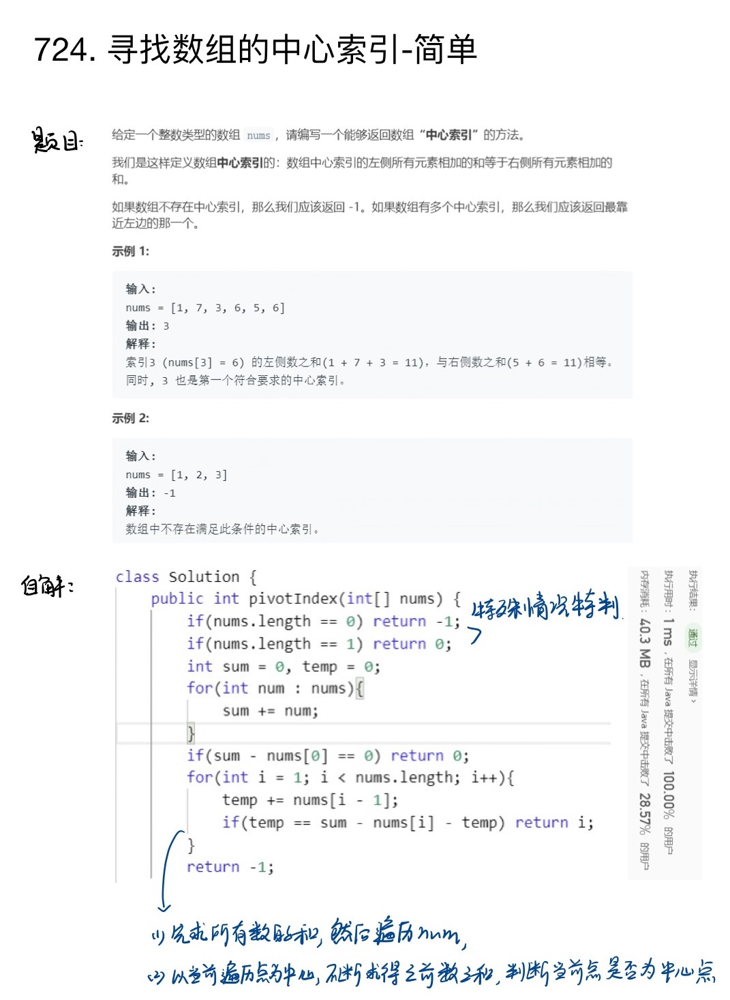

### 题目地址：https://leetcode-cn.com/problems/find-pivot-index/
### 题解：
``` java
class Solution {
    public int pivotIndex(int[] nums) {
        if(nums.length == 0) return -1;
        if(nums.length == 1) return 0;
        int sum = 0, temp = 0;
        for(int num : nums){
            sum += num;
        }
        if(sum - nums[0] == 0) return 0;
        for(int i = 1; i < nums.length; i++){
            temp += nums[i - 1];
            if(temp == sum - nums[i] - temp) return i;
        }
        return -1;
    }
}
```

### IPAD上笔记：


### python3
``` python
class Solution:
    def pivotIndex(self, nums: List[int]) -> int:
        numslength = len(nums);
        if numslength == 0:
            return -1
        if numslength == 1:
            return 0
        sumAll = 0
        for num in nums:
            sumAll += num
        if(sumAll - nums[0] == 0):
            return 0
        temp = 0
        for i in range(1, numslength):
            temp += nums[i - 1]
            if sumAll - temp - nums[i] == temp:
                return i
        return -1
```
