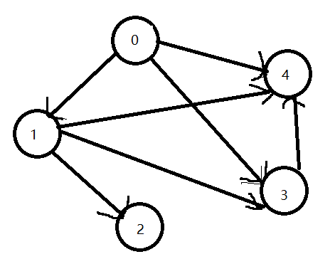

### 题目地址：https://leetcode-cn.com/problems/all-paths-from-source-to-target/

给一个有 n 个结点的有向无环图，找到所有从 0 到 n-1 的路径并输出（不要求按顺序）

二维数组的第 i 个数组中的单元都表示有向图中 i 号结点所能到达的下一些结点（译者注：有向图是有方向的，即规定了 a→b 你就不能从 b→a ）空就是没有下一个结点了。 

**示例 1：**

``` java
输入：graph = [[1,2],[3],[3],[]]
输出：[[0,1,3],[0,2,3]]
解释：有两条路径 0 -> 1 -> 3 和 0 -> 2 -> 3
```


**示例 2：**

``` java
输入：graph = [[4,3,1],[3,2,4],[3],[4],[]]
输出：[[0,4],[0,3,4],[0,1,3,4],[0,1,2,3,4],[0,1,4]]
```


**示例 3：**

``` java
输入：graph = [[1],[]]
输出：[[0,1]]
```

**示例 4：**

``` java
输入：graph = [[1,2,3],[2],[3],[]]
输出：[[0,1,2,3],[0,2,3],[0,3]]
```

**示例 5：**

``` java
输入：graph = [[1,3],[2],[3],[]]
输出：[[0,1,2,3],[0,3]]
```

**JAVA**

``` java
class Solution {
    List<List<Integer>> res = new ArrayList<>();

    public List<List<Integer>> allPathsSourceTarget(int[][] graph) {
        List<Integer> path = new ArrayList<>();
        // 注意
        path.add(0);
        backtrack(graph, path, 0);
        return res;
    }

    public void backtrack(int[][] graph, List<Integer> path, int index){
        // 注意注意注意！！！
        if(index == graph.length - 1){
            res.add(new ArrayList<>(path));
            return;
        }
        for(int i : graph[index]){
            path.add(i);
            // 注意,这里传递的是i,而不是i++,直接到i结点去
            backtrack(graph, path, i);
            path.remove(path.size() - 1);
        }
    }
}
```

**解释：**

- 这直接是一个dfs，注意在开始的时候已经加入了0（`path.add(0)`)，是因为当传递给backtrack函数的时候，index的初值为0，代表了直接开始找0号节点直接相连的节点，因此需要提前加入path
- 开始做题的时候，我使用了一个数组用于记录0~n-1的值是否被使用过，但是注意审题，是一个有向无环图，因此不需要这个步骤
- `backtrack(graph, path, i);`，在很多时候，我们回溯的时候都写的`i++`，但是以前不管是i++还是root.left、root.right都是想进入下一层，这里直接传递i，就是到这个结点位置上去找它邻近的结点，这里是利用了结点号和数组号直接对应的关系

- 发现一个问题：
  - 有些人贴出来的解答现在已经无法正常通过全部测试用例，因为题目的要求是：要以n-1数字结尾的，才可以，而不是只要搜索为为空就加入结果集，对于下面这个图，[0, 1, 2]就是一个不合格的用例，因为必须以4结尾，因此[0, 1, 4]才是合格的结果，所以在判断的时候使用`if(index == graph.length - 1)`
  - 

