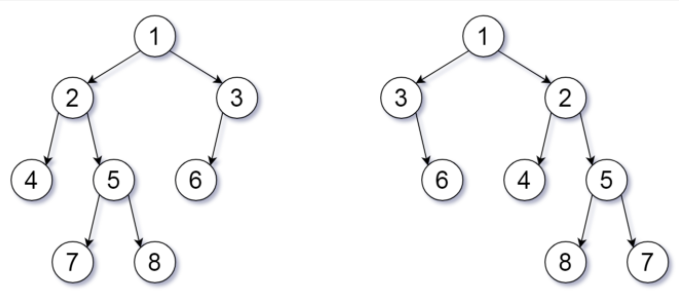

### 951. 翻转等价二叉树

#### 题目地址：https://leetcode-cn.com/problems/flip-equivalent-binary-trees/

我们可以为二叉树 T 定义一个翻转操作，如下所示：选择任意节点，然后交换它的左子树和右子树。

只要经过一定次数的翻转操作后，能使 X 等于 Y，我们就称二叉树 X 翻转等价于二叉树 Y。

编写一个判断两个二叉树是否是翻转等价的函数。这些树由根节点 root1 和 root2 给出。

 

**示例：**

```
输入：root1 = [1,2,3,4,5,6,null,null,null,7,8], root2 = [1,3,2,null,6,4,5,null,null,null,null,8,7]
输出：true
解释：我们翻转值为 1，3 以及 5 的三个节点。
```



**提示：**

1. 每棵树最多有 `100` 个节点。
2. 每棵树中的每个值都是唯一的、在 `[0, 99]` 范围内的整数。

---

**Java**

``` java
/**
 * Definition for a binary tree node.
 * public class TreeNode {
 *     int val;
 *     TreeNode left;
 *     TreeNode right;
 *     TreeNode() {}
 *     TreeNode(int val) { this.val = val; }
 *     TreeNode(int val, TreeNode left, TreeNode right) {
 *         this.val = val;
 *         this.left = left;
 *         this.right = right;
 *     }
 * }
 */
class Solution {
    public boolean flipEquiv(TreeNode root1, TreeNode root2) {
        if(root1 == null && root2 == null) return true;
        if(root2 == null || root2 == null) return false;
        if(root1.val == root2.val){
            // 每个结点可能被翻了， 也可能没被翻
            return (flipEquiv(root1.left, root2.left) && flipEquiv(root1.right, root2.right))
                    || (flipEquiv(root1.left, root2.right) && flipEquiv(root1.right, root2.left));
        }
        return false;
    }
}
```

