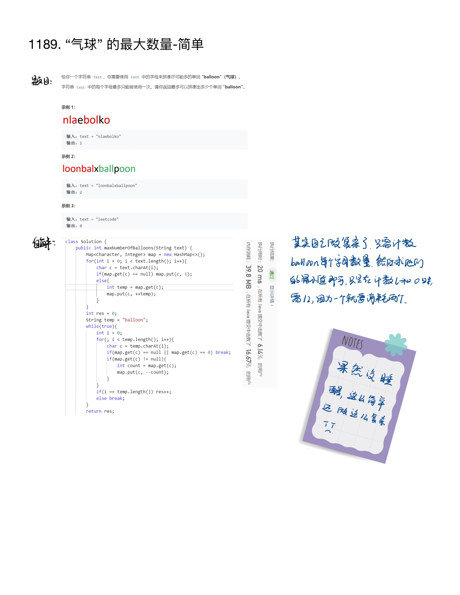

题目地址：https://leetcode-cn.com/problems/maximum-number-of-balloons/

``` java
class Solution {
    public int maxNumberOfBalloons(String text) {
        Map<Character, Integer> map = new HashMap<>();
        for(int i = 0; i < text.length(); i++){
            char c = text.charAt(i);
            if(map.get(c) == null) map.put(c, 1);
            else{
                int temp = map.get(c);
                map.put(c, ++temp);
            }
        }
        int res = 0;
        String temp = "balloon";
        while(true){
            int i = 0;
            for(; i < temp.length(); i++){
                char c = temp.charAt(i);
                if(map.get(c) == null || map.get(c) == 0) break;
                if(map.get(c) != null){
                    int count = map.get(c);
                    map.put(c, --count);
                }
            }
            if(i == temp.length()) res++;
            else break;
        }
        return res;
    }
}
```
IPAD上面的记录：
