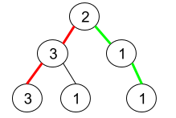

### 1457. 二叉树中的伪回文路径

#### 题目地址：https://leetcode-cn.com/problems/pseudo-palindromic-paths-in-a-binary-tree/

给你一棵二叉树，每个节点的值为 1 到 9 。我们称二叉树中的一条路径是 「伪回文」的，当它满足：路径经过的所有节点值的排列中，存在一个回文序列。

请你返回从根到叶子节点的所有路径中 伪回文 路径的数目。

 

**示例 1：**



```
输入：root = [2,3,1,3,1,null,1]
输出：2 
解释：上图为给定的二叉树。总共有 3 条从根到叶子的路径：红色路径 [2,3,3] ，绿色路径 [2,1,1] 和路径 [2,3,1] 。
     在这些路径中，只有红色和绿色的路径是伪回文路径，因为红色路径 [2,3,3] 存在回文排列 [3,2,3] ，绿色路径 [2,1,1] 存在回文排列 [1,2,1] 。
```

**示例 2：**


```
输入：root = [2,1,1,1,3,null,null,null,null,null,1]
输出：1 
解释：上图为给定二叉树。总共有 3 条从根到叶子的路径：绿色路径 [2,1,1] ，路径 [2,1,3,1] 和路径 [2,1] 。
     这些路径中只有绿色路径是伪回文路径，因为 [2,1,1] 存在回文排列 [1,2,1] 。
```

**示例 3：**

```
输入：root = [9]
输出：1
```

**提示：**

- 给定二叉树的节点数目在 `1` 到 `10^5` 之间。
- 节点值在 `1` 到 `9` 之间。

---

**Java**

``` java
/**
 * Definition for a binary tree node.
 * public class TreeNode {
 *     int val;
 *     TreeNode left;
 *     TreeNode right;
 *     TreeNode() {}
 *     TreeNode(int val) { this.val = val; }
 *     TreeNode(int val, TreeNode left, TreeNode right) {
 *         this.val = val;
 *         this.left = left;
 *         this.right = right;
 *     }
 * }
 */
class Solution {
    Map<Integer, Integer> map = new HashMap<>();
    int res = 0;
    public int pseudoPalindromicPaths (TreeNode root) {
        inOrder(root);
        return res;
    }
    // 中序遍历
    public void inOrder(TreeNode node){
        if(node == null) return;
        // 计数 + 1, 做选择
        map.put(node.val, map.getOrDefault(node.val, 0) + 1);
        if(node.left == null && node.right == null){
            if(helper()) res++;
        }
        if(node.left != null) inOrder(node.left);
        if(node.right != null) inOrder(node.right);
        // 撤销选择
        map.put(node.val, map.getOrDefault(node.val, 1) - 1);
    }
    // 验证 Map，只要出现次数为奇数次的 <= 1，则代表是
    public boolean helper(){
        int oddCount = 0;
        for(int i : map.keySet()){
            if(map.get(i) % 2 != 0) oddCount++;
        }
        return oddCount <= 1;
    }
}
```

